<p align="center">
  
</p>

Your Meta Portal doesn't have to end up in a drawer. OpenPortal gives it a second life — install new apps, mirror its screen, and manage the whole device, right from your browser. No app to install, no drivers, no backend.

OpenPortal talks to your Portal over USB using [WebUSB](https://developer.mozilla.org/en-US/docs/Web/API/WebUSB_API) and [ya-webadb](https://github.com/yume-chan/ya-webadb) to speak the ADB protocol straight from a web page.

**[Open the app](https://andronedev.github.io/openportal/)** in a Chromium-based browser, no install required.

<!-- Screenshot: drop an image at docs/screenshot.png and uncomment the line below -->
<!--  -->

## Features

- **Connect over USB**: plug in your Portal and click Connect. The RSA key is generated and kept in your browser, and the app recovers on its own if the cable is pulled.
- **App catalog**: one-click install of community-verified apps. The Portal downloads the APK itself (GitHub releases or F-Droid, so there's no backend or CORS proxy), with update detection and post-install setup.
- **Sideload APKs**: drag and drop any `.apk` onto the page to install it.
- **Manage installed apps**: launch, uninstall, clear data, force stop, and inspect permissions.
- **Screen mirroring**: your Portal's screen in the browser via real **scrcpy** (H.264 to WebCodecs). Control it with the mouse, type with your keyboard, go fullscreen, or grab a PNG screenshot.
- **File browser**: browse, upload, download, and delete files over ADB sync.
- **Terminal**: a real interactive shell (xterm.js) with `top`, `vi`, colors, Ctrl-C, resize.
- **Logcat**: live log streaming with tag, priority, and text filters, plus export.
- **Feature flags**: browse and edit `device_config` flags and internal settings.

### Built for everyone

- **Classic / Advanced modes**: Classic keeps it to the essentials; Advanced unlocks Files, Terminal, Logcat, and Flags.
- **Keyboard shortcuts**: press `?` for the overlay.
- **English & French**, structured so more languages are easy to add.
- **Installable PWA**: works offline after the first load.

## Requirements

- A **Chromium-based browser** (Chrome, Edge, Brave, Opera). WebUSB is not available in Firefox or Safari.
- **HTTPS or localhost**, because WebUSB needs a secure context.
- A **Meta Portal** with USB debugging enabled (Settings > Debug > ADB Enabled).

## Supported devices

All Meta Portal devices are supported. If yours isn't recognized or something doesn't work, please [open an issue](https://github.com/andronedev/openportal/issues).

Every Portal has a **USB-C** data port on the back; you may need to lift a small cover or flip out the stand to reach it. Use a real **data** cable, since charge-only cables won't enumerate the device.

## Getting started

```bash
pnpm install
pnpm dev
```

Open `http://localhost:5173` in Chrome, plug in your Portal, and click **Connect**.

No device on hand? Add `?demo` to preview the UI with a mock device: `http://localhost:5173/?demo`

## Build

```bash
pnpm build
```

The `dist/` folder is a static site you can host anywhere with HTTPS (GitHub Pages, Vercel, Netlify, Cloudflare Pages).

## Tech stack

React 19 · Vite 6 · TypeScript · Tailwind CSS 4 · Zustand · React Router 7 · react-i18next · ya-webadb · xterm.js · Biome

## Add a badge to your app

Built an app that's in the catalog? Link straight to it from your own README or website. Every catalog app has a shareable page at `…/apps/<package-name>` that opens the app's card — no device required.

Paste this into your README and replace `YOUR.PACKAGE.NAME` with your app's Android package name (the same `packageName` as in its catalog entry):

```md
[](https://andronedev.github.io/openportal/apps/YOUR.PACKAGE.NAME)
```

For example, Portal Calendar (`com.portal.calendar`) renders as:

[](https://andronedev.github.io/openportal/apps/com.portal.calendar)

Just want the plain link? It's `https://andronedev.github.io/openportal/apps/YOUR.PACKAGE.NAME` — you can also grab it straight from the app's detail dialog with the **Copy link** button.

## Contributing

The app catalog lives in [`src/lib/portal/catalog.json`](src/lib/portal/catalog.json). It's data-only, so you can add an app with a pull request and no code change. See [CONTRIBUTING.md](CONTRIBUTING.md) for the field schema and conventions.

## Legal

Meta [officially enabled ADB access](https://developers.meta.com/horizon/blog/build-apps-for-portal-with-ai/) on Portal devices. OpenPortal uses only public ADB commands: no exploits, no root, no bootloader unlock.

Screen mirroring bundles the [scrcpy](https://github.com/Genymobile/scrcpy) server binary (`public/scrcpy-server`, v2.3, Apache-2.0). It is pushed to the device on demand and never modifies it.

## License

MIT
